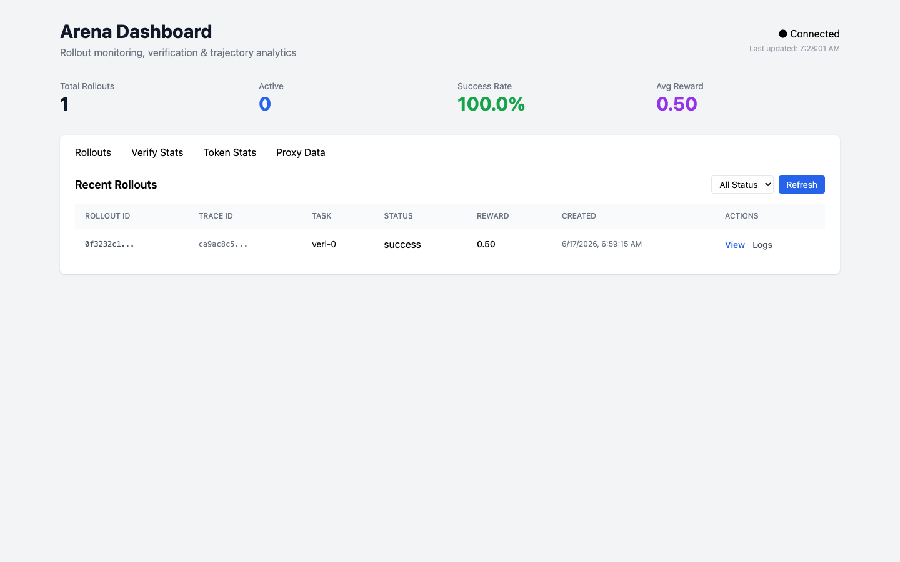
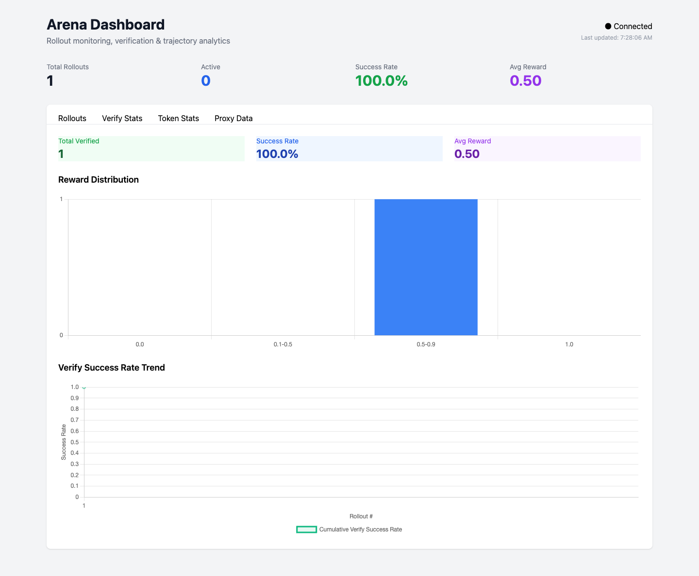
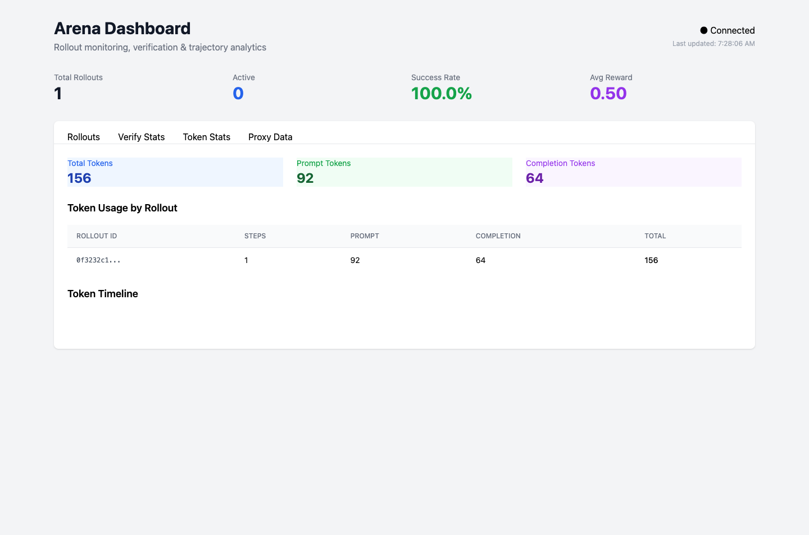

# OpenAgora

[](https://github.com/albert-lv/OpenAgora/actions/workflows/go.yml)
[](https://github.com/albert-lv/OpenAgora/actions/workflows/python.yml)
[](https://opensource.org/licenses/Apache-2.0)
[](https://go.dev/)
[](https://www.python.org/)

English | [简体中文](README.zh-CN.md)

**Arena is an open-source rollout, verification, and trajectory plane for agentic reinforcement learning.**

It provides the missing infrastructure layer between RL trainers (veRL, ROLL, TRL) and agent execution environments. Whether you are building a coding agent, a web agent, or a general-purpose autonomous system, Arena gives you a reproducible, observable, and RL-ready execution pipeline.

---

## What is Arena?

Training agents with reinforcement learning requires more than just an LLM API. You need:

- **Controlled rollouts** — deterministic sampling, token budgets, and trajectory capture
- **Sandboxed execution** — safe, reproducible environments for your agents
- **Decoupled verification** — reward computation independent from agent logic
- **Structured trajectory data** — training-grade data for PPO, GRPO, DPO, and more

Arena provides all four as composable, language-agnostic planes.

### Four Planes

| Plane | Purpose | Status |
|-------|---------|--------|
| **Rollout Control Plane** | LLM proxy with sampling injection and trajectory capture | ✅ Available |
| **Sandbox Plane** | Containerized agent execution (Docker v1) | ✅ Available |
| **Verification Plane** | Structured SWE-bench verification + multi-language parsers | ✅ Available |
| **Trajectory Data Plane** | Structured, append-only trajectory storage | ✅ Available |

See [docs/architecture.md](docs/architecture.md) for the full design.

---

## Quick Start

Get your first rollout running in under 5 minutes.

### Prerequisites

- [Docker](https://docs.docker.com/get-docker/)
- [Go 1.25+](https://go.dev/dl/)
- [Python 3.10+](https://www.python.org/downloads/)
- [uv](https://docs.astral.sh/uv/getting-started/installation/) (for Python development)

### 1. Clone and Build

```bash
git clone https://github.com/albert-lv/OpenAgora.git
cd OpenAgora
make build
```

### 2. Start the Arena Server

```bash
./bin/openagora-server
# Server listening on :9090
```

> **Note:** The quickstart uses the Docker sandbox provider by default. Make sure Docker is installed and running before proceeding. If you do not have Docker, you can start the server with a mock sandbox instead:
> ```bash
> ./bin/openagora-server --sandbox=mock
> ```
> The mock provider does not create real containers, but the rest of the flow (proxy, trajectory, verification) works normally.

> **Note on LLM backend:** The default `task.json` points to a mock LLM. Arena supports Ollama, vLLM, and SGLang as inference backends. The proxy injects `logprobs` for all backends and `top_logprobs` for vLLM/SGLang. See [docs/getting-started.md](docs/getting-started.md) for backend setup instructions.

### 3. Run Your First Rollout

In another terminal:

```bash
cd examples/quickstart
./run.sh
```

You should see a rollout complete with captured trajectory steps and a reward.

For more details, check out [examples/quickstart/README.md](examples/quickstart/README.md) and [docs/getting-started.md](docs/getting-started.md).

---

## Demo: Code Colosseum Dashboard

For a complete end-to-end demo that shows **live agent duels** and a **real GRPO training loop improving a model**, run the **Code Colosseum** stack.

Key points:

- The trainer starts an **OpenAI-compatible LLM server** that serves the current actor policy.
- Every Arena rollout calls this server, so each GRPO update is immediately reflected in the next generation.
- The Dashboard shows **reward/loss curves improving over iterations** in real time.

### One-command demo

```bash
docker compose -f examples/code-colosseum/docker-compose.yml up --build
```

Then open **http://localhost:3000**. The first run downloads the configured model (default `Qwen/Qwen2.5-0.5B-Instruct`) into the mounted HuggingFace cache (`~/.cache/huggingface`).

To use a different model, edit `MODEL_NAME` in `examples/code-colosseum/docker-compose.yml`, e.g. `Qwen/Qwen3.5-0.8B`.

### Local development

Run the services separately (useful when hacking on the UI, orchestrator, or trainer):

1. **Install Python dependencies**

   ```bash
   cd examples/code-colosseum/backend
   python3 -m venv .venv
   source .venv/bin/activate
   pip install -e ../../../python/openagora-sdk
   pip install fastapi uvicorn pydantic
   ```

   The trainer also needs `torch`, `transformers`, `peft`, `fastapi`, and `uvicorn` (install them in the same or another venv).

2. **Start the Arena server**

   ```bash
   ./bin/openagora-server
   ```

3. **Start the Code Colosseum orchestrator**

   ```bash
   cd examples/code-colosseum
   PROBLEMS_DIR=./problems TRAINING_METRICS_PATH=./backend/data/metrics.jsonl \
     uvicorn backend.main:app --host 0.0.0.0 --port 8080
   ```

4. **Start the GRPO trainer / policy LLM server**

   ```bash
   cd examples/code-colosseum/training
   python3 train_colosseum.py
   ```

   The trainer starts an LLM backend on port `8000` and writes metrics to `METRICS_PATH`. The orchestrator serves them at `/api/training/status`.

5. **Start the Dashboard**

   ```bash
   cd examples/code-colosseum/dashboard
   npm install
   npm run dev
   ```

   Then open **http://localhost:5173**.

### Dashboard tabs

- 🌌 **Command Center** — the epic Arena + GRPO command center: live duel, agent code, battle log, and GRPO reward distribution in one screen.
- ⚔️ **Arena** — pick a problem, start a duel between two agents, and watch the live battle with code panes and battle logs.
- 🏆 **Leaderboard** — Elo ratings and win/loss/draw records.
- 📈 **Training** — live GRPO reward/loss/KL curves and per-group reward distribution.

See [examples/code-colosseum/README.md](examples/code-colosseum/README.md) for the full demo guide.

---

## Demo: Relationship Chat RL

A minimal end-to-end PPO example that teaches a small language model to reply to a partner's message in a more empathetic way. It uses:

- **Actor model**: `Qwen/Qwen3.5-0.8B` (LoRA-tuned on CPU)
- **Rollout backend**: `qwen3.5:0.8b` via Ollama
- **Sandbox**: local (no extra Docker-in-Docker needed on macOS)
- **Verification**: a simple rubric scorer that checks for required/avoided phrases

### One-command demo

```bash
cd examples/relationship-chat-rl
docker compose up --build
```

The stack starts Ollama, the Arena server, and the CPU trainer. The first run uses the HuggingFace cache mounted from `~/.cache/huggingface`, so make sure `Qwen/Qwen3.5-0.8B` is pre-downloaded there.

### What you will see

After the rollout and PPO update complete, open the Arena Dashboard at **http://localhost:9091**:

| Rollouts | Verify Stats | Token Stats |
|---|---|---|
|  |  |  |

The trainer writes metrics to `examples/relationship-chat-rl/data/metrics.jsonl` and saves the LoRA checkpoint to `examples/relationship-chat-rl/checkpoints/checkpoint-1/`.

See [examples/relationship-chat-rl/README.md](examples/relationship-chat-rl/README.md) for the full guide.

---

## Why Arena?

| Capability | Arena | ROCK | LiteLLM | E2B | SWE-Gym |
|-----------|-------|------|---------|-----|---------|
| LLM Proxy with active control | ✅ | ❌ | passive | ❌ | ❌ |
| Sampling injection per rollout | ✅ | ❌ | ❌ | ❌ | ❌ |
| Independent verification plane | ✅ | ❌ | ❌ | ❌ | coupled |
| RL-grade trajectory schema | ✅ | ❌ | ❌ | ❌ | ❌ |
| Language-agnostic agent contract | ✅ | partial | N/A | partial | partial |

---

## Project Structure

```
OpenAgora/
├── go/                      # Go core (server, proxy, sandbox orchestration)
│   ├── cmd/                 # Binaries (openagora-server, demo)
│   └── pkg/                 # Reusable packages
├── proto/                   # Protobuf / gRPC schemas
├── python/                  # Python ecosystem
│   ├── openagora-sdk/           # Python client for Arena
│   ├── openagora-verify/        # Verification plugins
│   └── openagora-verl/          # veRL trainer adapter
├── docker/                  # Docker images
├── docs/                    # Documentation
├── examples/                # Quickstart and trainer integrations
├── Makefile                 # Common development tasks
└── README.md                # You are here
```

---

## Installation

### Go Server

```bash
make build
# Output: ./bin/openagora-server
```

### Python SDK

```bash
cd python/openagora-sdk
uv sync
```

### Docker Images

```bash
make docker-server    # openagora-server:latest
make docker-agent     # openagora-agent-minimal:latest
```

---

## Usage Examples

### Build a Custom Agent

Any container that follows the [Sandbox Contract](docs/sandbox-contract.md) can run in Arena. The contract is simple:

1. Read the task from `/sandbox/.arena/task.json`
2. Route LLM calls through the `OPENAI_BASE_URL` injected by Arena
3. Signal completion by writing `/sandbox/.arena/done`

That is it — language-agnostic and framework-agnostic.

### Python Client

```python
from openagora_sdk.client import ArenaClient

client = ArenaClient("localhost:9090")

rollout_id = client.create_rollout(
    task_id="my-task",
    image="openagora-agent-minimal:latest",
    llm_backend="http://localhost:8000/v1",
)

result = client.wait(rollout_id)
print(f"Status: {result['status']}, Reward: {result['reward']}")
```

More examples live in [examples/](examples/).

---

## Roadmap

We are building Arena in public. Here is what is coming next:

- [ ] Additional sandbox providers (E2B, OpenSandbox)
- [ ] Parquet and S3 trajectory backends
- [ ] Streaming trajectory consumption for online RL
- [x] Structured SWE-bench style verification
- [ ] LLM-as-judge verification
- [ ] Distributed rollout workers
- [ ] Observability dashboards

Have an idea? Open a [discussion](https://github.com/albert-lv/OpenAgora/discussions) or [issue](https://github.com/albert-lv/OpenAgora/issues).

---

## Contributing

We love contributions! Please read our [Contributing Guide](CONTRIBUTING.md) to get started.

A few quick ways to help:

- **Report bugs** — [open an issue](https://github.com/albert-lv/OpenAgora/issues/new?template=bug_report.md)
- **Request features** — [open an issue](https://github.com/albert-lv/OpenAgora/issues/new?template=feature_request.md)
- **Submit improvements** — [open a pull request](https://github.com/albert-lv/OpenAgora/pulls)
- **Spread the word** — star the repo and share with others

Please note that this project is released with a [Contributor Code of Conduct](CODE_OF_CONDUCT.md). By participating, you agree to abide by its terms.

---

## Community

- 💬 [GitHub Discussions](https://github.com/albert-lv/OpenAgora/discussions) — ask questions, share ideas
- 🐛 [GitHub Issues](https://github.com/albert-lv/OpenAgora/issues) — bug reports and feature requests
- 📧 For security issues, please email the maintainers directly instead of opening a public issue

---

## License

OpenAgora is licensed under the [Apache License 2.0](LICENSE).

---

<p align="center">Built with ❤️ for the open agentic RL community.</p>
