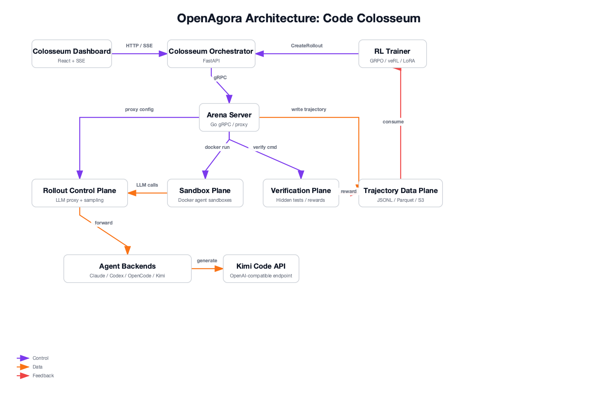

# Architecture Overview

Arena is built around four independent planes that can be used together or separately.
The diagram below shows how a concrete end-to-end demo — **Code Colosseum** — maps onto those planes.



## Four Planes

### 1. Rollout Control Plane (LLM Proxy)

The heart of Arena. It sits transparently between the agent and the LLM backend.

- **Sampling Injection**: Override temperature, top_p, seed per rollout
- **Token Budget Enforcement**: Hard limit on total tokens per rollout
- **Trajectory Capture**: Every request/response is recorded to the Trajectory Data Plane
- **Multi-Backend Routing**: vLLM, SGLang, or any OpenAI-compatible endpoint

### 2. Sandbox Plane

Containerized execution environment for the agent.

- **v1**: Docker (local)
- **Future**: E2B, ROCK, OpenSandbox
- **Lifecycle**: Create → Start → Run → Stop → Destroy
- **Contract**: Agent reads `task.json`, writes `done`, uses `OPENAI_BASE_URL`

### 3. Verification Plane

Decoupled from the agent. Runs after the agent signals completion.

- **Command-based**: `pytest -k regression`
- **Plugin-based**: Custom reward functions
- **Pass-to-pass / Fail-to-pass**: SWE-bench style evaluation

### 4. Trajectory Data Plane

Structured, append-only storage for RL training.

- **Schema v0**: `TrajectoryStep` with `LLMRequest`, `LLMResponse`, `Reward[]`
- **Backends**: Local JSONL (v1), Parquet, S3, remote gRPC
- **Streaming**: Real-time `StreamTrajectory` for online RL

## Data Flow

```
1. Trainer (veRL) → Arena gRPC: CreateRollout(task, config)
                        ↓
2. Arena Sandbox Plane: docker run --env OPENAI_BASE_URL=...
                        ↓
3. Agent starts, reads task.json, begins work
                        ↓
4. Agent → LLM Proxy (Arena)
   a. Proxy injects sampling parameters
   b. Proxy checks token budget
   c. Proxy forwards to vLLM/SGLang
   d. Proxy captures req+resp → Trajectory Writer
   e. Proxy returns response to Agent
                        ↓
5. Repeat step 4 until done or budget exhausted
                        ↓
6. Arena Verify Plane: docker exec → pytest → reward
                        ↓
7. Arena Trajectory Plane: write full trajectory → JSONL/Parquet
                        ↓
8. gRPC StreamTrajectory → Trainer consumes for training
```

## Technology Stack

- **Go**: Core server, proxy, sandbox orchestration
- **Python**: SDK, veRL adapter, verification plugins
- **gRPC**: Service API + streaming
- **Protobuf**: Schema definitions
- **Docker**: v1 sandbox runtime

## Extensibility

| Extension Point | How |
|----------------|-----|
| New Sandbox Provider | Implement `sandbox.Provider` interface |
| New Trajectory Backend | Implement `trajectory.Backend` interface |
| New Verification Plugin | Python package in `openagora-verify/` |
| New Trainer Adapter | Python package following `openagora-verl` pattern |
